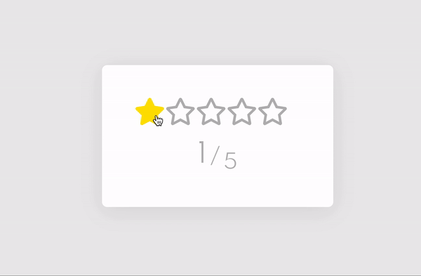

# vue-star-rating :star: 

A lightweight and minimal star rating component to rate products, comments, posts on the Vue.js application.


 
 ## Demo
 
 See <a href="https://ramazanerikli.github.io/vue-star-rating/">vue-star-rating</a> in action.

## Features

  - Counter

## How to Use

1. Import the Star Rating Component.

```
import Rating from './components/Rating.vue'
```
2. Add the star rating component to the app template and adjust the current and max rating values as follows:

```
<Rating :grade="3" :maxStars="5" :hasCounter="true" />
```
3. Render the star rating component.

```
export default {
  name: 'App',
  components: {
    Rating
  },
  beforeCreate: function() {
    // do something
  }
}
```

## Installation
```
npm install
```

## Compiles and hot-reloads for development
```
npm run serve
```

## Compiles and minifies for production
```
npm run build
```

## Lints and fixes files
```
npm run lint
```

## Customize configuration
See [Configuration Reference](https://cli.vuejs.org/config/).
